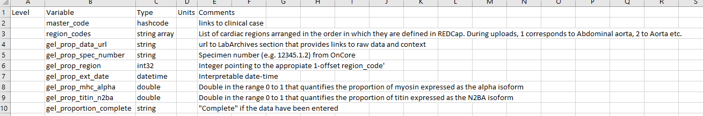

# Project_cvbr_myocardial_data

## Uploading new experimental data

### Overview

+ Organize new experimental data in a format that is consistent with `expt_data.json`
+ Use `MATLAB_cardiac_biobank/create_expt_import_file.m` to create `import.csv`
+ Manually upload `import.csv` to REDCap

### Data formatting

`MATLAB_cardiac_biobank/dictionaries/expt_data.json` is a JSON-formatted file that describes the internal format for the REDCap database for experimental data "Cardiac tissue - experimental data".

The file starts like this

````
{
    "master_code": "record_id",
    "region_codes":
    [
        "Abdominal Aorta",
        "Aorta",
        "Aortic Leaflet",
<SNIP>
        "Septum"
    ],
    "instruments":
    [
        {
            "name": "gel_proportion",
            "fields":
            [
                {
                    "name": "gel_prop_data_url",
                    "type": "string"
                },
                {
                    "name": "gel_prop_spec_number",
                    "type": "string"
                }
<SNIP>
````

The documentation for the file is explained in [upload_formats.xlsx](upload_formats.xlsx)

Screenshot for xlsx file.



### Instructions

+ Organize your new experimental data as an Excel file where:
  + the top row contains variable names
  + rows 2 onwards correspond to a new instance of a repeating instrument

  + one column must be labeled as `record_id`
    + each data row for this column must be a valid hashcode

  + additional columns that
    + match variables in [upload_formats.xlsx](upload_formats.xlsx) will be added to REDCap.
    + do not match will be ignored

    + As an example, if you have measured:
    + 3 technical replicates of `gel_prop_mhc_alpha`
        + for each of 2 regions
          + in each of 5 hearts
        
    + your spreadsheet must, at minimum,
        + have colums:
          + `record_id`
          + `gel_prop_mhc_alpha`
        + and
          + 1 header row
          + (3 x 2 x 5) = 30 data rows

+ Open MATLAB

+ Switch the MATLAB working directory to `<repo>MATLAB_cardiac_biobank`

+ Run
````
create_expt_import_file('new_data_file_string', my_new_data.xlsx)
````

+ This should create a new file `<repo>MATLAB_cardiac_biobank/import/import.csv`

+ Upload this file to REDCap.
